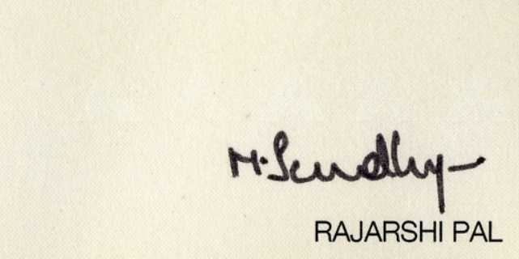
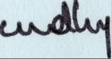

## Connected Components Algorithm

Major Assumption: The signatures we want to extract will always be connected.

**Idea**  
To remove that non-useful text, we used a connected components labeling algorithm to fit a tight box around the signature. 
Two passes of connected component labeling were applied to get the connected components in an image. 

Then rectangle fitting was applied to the detected connected components. Components are selected on the basis of the maximum area of the rectangle.

After passing images through OCR we will use ***Connected Components Algorithm*** to extract the signatures
from the image.

### Tools Used

1. OpenCV [see here](F:\BTech\Capstone Project\Signature_Detecttion-Verfication\Project_Code\Signature_Detection\Line Sweep\readme.md)
2. Python Image Library (PIL) [see here](F:\BTech\Capstone Project\Signature_Detecttion-Verfication\Project_Code\Signature_Detection\Line Sweep\readme.md)
3. Union Find Array (Self made module to implement Union Find)

But this technique failed as our assumption is wrong.

We might have signatures which are not connected.  
Example 

   
So the output of this signature will be wrong

    

###### Refer for Documentation 
* Connected Component Algorithm - https://www.geeksforgeeks.org/connected-components-in-an-undirected-graph/
* Union Find Array - https://www.geeksforgeeks.org/number-of-connected-components-of-a-graph-using-disjoint-set-union/
