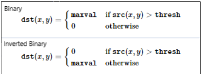
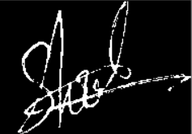
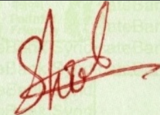
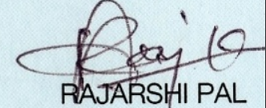

## LineSweep Algorithm

We have used OCR based Signature Detection  
But, we have used different algorithm for rectangle fitting across the signature. 

The **Line-Sweeping algorithm** was run in both ways: vertically and horizontally.  
On the basis of this, the exact signature is detected and after that this image is passed as an input to the verification algorithm.

The Result Images obtained from OCR based Signature Verification Approach are now passed through Line Sweep Algorithm.  

### Tools Used

1. **OpenCV-Python** is a library of Python bindings designed to solve computer vision problems.

2. The **Python Imaging Library (PIL)** adds image processing capabilities to your Python interpreter.

    * This library provides extensive file format support, an efficient internal representation, and fairly powerful image processing capabilities.

    * The core image library is designed for fast access to data stored in a few basic pixel formats. It should provide a solid foundation for a general image processing tool.
    
    * The *Image* module provides a class with the same name which is used to represent a PIL image. The module also provides a number of factory functions, including functions to load images from files, and to create new images.

### Steps
**Step 1**: 

The OCR Result Images are read from the Result Folder.

**Step 2**: 

The image picked is converted into grayscale using PIL library function
     
    Image.convert(mode=None, matrix=None, dither=None, palette=Palette.WEB, colors=256)

    Returns a converted copy of this image.
    For the “P” mode, this method translates pixels through the palette. 
    If mode is omitted, a mode is chosen so that all information in the image and the palette can be represented without a palette.

    The current version supports all possible conversions between “L”, “RGB” and “CMYK.” The matrix argument only supports “L” and “RGB”.

When translating a color image to greyscale (mode “L”), the library uses the ITU-R 601-2 luma transform:
    
    L = R * 299/1000 + G * 587/1000 + B * 114/1000

To convert into grayscale:
    
    img.convert("L")

**Step 3**: 

Find the **threshold** of the image.

Thresholding is a technique in OpenCV, which is the assignment of pixel values in relation to the threshold value provided. 
In thresholding, each pixel value is compared with the threshold value. If the pixel value is smaller than the threshold, it is set to 0, otherwise, it is set to a maximum value (generally 255).

Thresholding is a very popular segmentation technique, used for separating an object considered as a foreground from its background.
    
openCV has an inbuilt function for this.

    cv2.threshold(source, thresholdValue, maxVal, thresholdingTechnique) 
    
    Parameters: 
    -> source: Input Image array (must be in Grayscale). 
    -> thresholdValue: Value of Threshold below and above which pixel values will change accordingly. 
    -> maxVal: Maximum value that can be assigned to a pixel. 
    -> thresholdingTechnique: The type of thresholding to be applied. 

The main types of Thresholding techniques are:
* cv2.THRESH_BINARY
* cv2.THRESH_BINARY_INV

We have used the inverse Binary thresholding technique so that we can only keep the foreground and darken the background.

The result of the above thresholding is 

**Step 4**: 

Now we will find the starting X and Y indexes alongwith ending X and Y indexes of the thresholded image. 

**Step 5**: 

After the indexes have been found we will mark the boundaries of the signature using an opencv function. 
cv2.line() method is used to draw a line on any image.
This will act as a boundary marker for the image to be cropped.

      cv2.line(image, start_point, end_point, color, thickness) 
      Parameters: 
      
      -> image: It is the image on which line is to be drawn.
      -> start_point: It is the starting coordinates of the line. The coordinates are represented as tuples of two values i.e. (X coordinate value, Y coordinate value). 
      -> end_point: It is the ending coordinates of the line. The coordinates are represented as tuples of two values i.e. (X coordinate value, Y coordinate value). 
      -> color: It is the color of the line to be drawn. For RGB, we pass a tuple. eg: (255, 0, 0) for blue color.
      -> thickness: It is the thickness of the line in px. 
   

**Step 6**:

Once the boundary has been marked we will crop the image accordingly and store the required image into our result.

Results from LineSweep Algorithm

###### Refer for Documentation 
* Pytesseract - https://pypi.org/project/pytesseract/
* cv2 - https://pypi.org/project/opencv-python/
