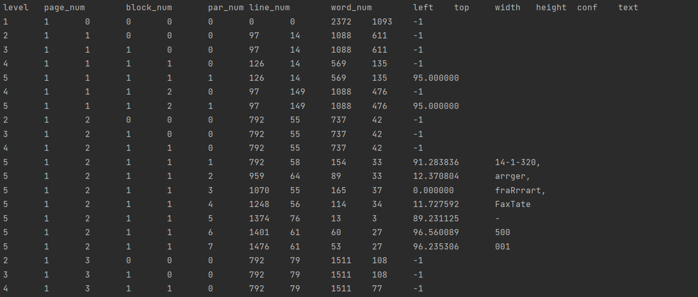

## OCR based Signature Detection

### Tool: pytesseract, OpenCV

**Python-tesseract** is an optical character recognition (OCR) tool for python.
It will recognize and “read” the text embedded in images.

**OpenCV-Python** is a library of Python bindings designed to solve computer vision problems.

Image is read from the */cheque_images* folder only if it is in *.jpg* format, using openCV module

    cv2.imread()

Now using pytesseract's inbuilt function we will extract the data from the image.
    
    pytesseract.image_to_data(Image.open('test.png'))

Result of extracting data from image

Now we can directly pick the text of the image.
We need *"Please sign above"*.

We can easily find these words and get their location in the image from the (left, top, width, height pointers).

Once the location of signatures is found, we can crop the image accordingly.

For cropping the image we will again use the opencv module

    cv2.rectangle(image, start_point, end_point, color, thickness)

Parameters:

* **image**: It is the image on which rectangle is to be drawn.
* **start_point**: It is the starting coordinates of rectangle. The coordinates are represented as tuples of two values i.e. (X coordinate value, Y coordinate value).
* **end_point**: It is the ending coordinates of rectangle. The coordinates are represented as tuples of two values i.e. (X coordinate value, Y coordinate value).
* **color**: It is the color of border line of rectangle to be drawn. For BGR, we pass a tuple. eg: (255, 0, 0) for blue color.
* **thickness**: It is the thickness of the rectangle border line in px. Thickness of -1 px will fill the rectangle shape by the specified color.

**Return Value**: It returns an image.

The resulting images are stored in the *Results* folder. 

###### Refer for Documentation 
* Pytesseract - https://pypi.org/project/pytesseract/
* cv2 - https://pypi.org/project/opencv-python/
