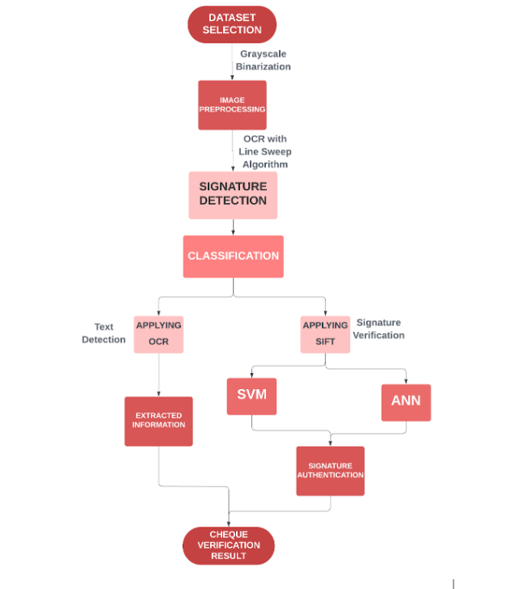

# Signature Verification on Bank Cheques to Reduce Fraud in Financial Institutions 

A conceptual model to detect and verify signatures on bank cheques. 
This is our **Final Year project** at **Thapar Institute of Engineering and Technology.**

Handwritten signatures are widely used as a means of personal identification and authentication. Many documents like bank cheques and legal transactions require signature verification. But considering a large number of documents, it is a very difficult and time-consuming task. Therefore, ensuring the necessity for a robust automatic signature verification tool that aims to reduce fraud in all related financial transaction sectors. 

The current visual verification depends mainly on the experience, mood, and working environment of the verifier which ultimately wastes both time and money. Moreover, it is difficult for the eyes of any experts to precisely verify the ratios between lines and angles of a genuine signature to a fraud signature. Therefore, we propose an automatic signature verification technique using the recent advances in image processing and machine learning.

Once the image of a handwritten signature for a customer is captured, several pre-processing steps will be performed to extract and enhance the signature. Finally, a verification process will be developed and applied to compare the extracted image features with those stored in the database for the specified customer.

We devised an OCR based approach to localize signatures along with Connected Components, Linesweep algorithm & geometric features with Support Vector Machine (SVM), Artificial Neural Networks (ANN) classification to verify the authenticity of signatures with a 91% hit rate.

### Workflow of the Project

### Description of files:
Signature_Detection folder contains codes for different approaches: 
* Contour features-based
* OCR + Connected Components labelling
* OCR + LineSweeping algorithm.

### Walk through
1. Install dependencies via: `pip install -r requirements.txt`
2. For execution of signature detection approaches 
   * OCR Approach File - run `python OCR_Algorithm.py` 
   * LineSweep Algorithm - run `python lineSweepDetect.py`  
   * Connected Components - run `python connectedComponent.py`

### Signature Verification Approaches

### OCR + Connected Components
After the images have been cropped by OCR technique, We will use the Connected Components Algorithm
to extract the signature from the image.
Assumption -> The signatures are going to be connected.
But this is not always true. So this technique fails.

### OCR + Line Sweep Algorithm
The OCR Approach -> Identify the signatures and crop the images
The LineSweep Algorithm -> Use OCR result images and do rectangle fitting across the signature.

