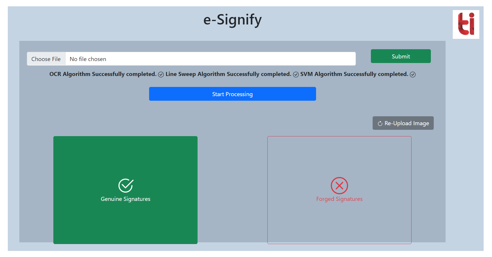

# Signature Verification on Bank Cheques to Reduce Fraud in Financial Institutions 

A conceptual model to detect and verify signatures on bank cheques. 

Handwritten signatures are a common method for personal identification and authentication, especially on documents like bank cheques and legal papers. However, verifying a large number of signatures manually is both challenging and time-consuming. This highlights the need for a robust automatic signature verification tool to reduce fraud in financial transactions.

Manual verification is subjective and can be influenced by the verifier's experience, mood, and environment, leading to inefficiencies and inaccuracies. Additionally, human eyes struggle to precisely compare the geometric features of genuine and fraudulent signatures. To address these issues, we propose an automatic signature verification technique leveraging recent advancements in image processing and machine learning.

Our approach involves capturing the image of a handwritten signature and performing several pre-processing steps to extract and enhance the signature. The verification process then compares the extracted image features with those stored in a database for the specified customer.

We have developed an OCR-based method to localize signatures, combined with Connected Components, Line Sweep algorithms, and geometric feature analysis. Using Support Vector Machine (SVM) and Artificial Neural Networks (ANN) classifiers, we achieve a 91% accuracy rate in verifying the authenticity of signatures.

### Workflow of the Project

### Description of files:
The `Signature_Detection` folder contains code implementations for various signature detection approaches:

* **Contour Features-Based**: Utilizes contour detection techniques to identify and extract signature regions from the document.
* **OCR + Connected Components Labelling**: Uses Optical Character Recognition (OCR) to localize potential signature areas, followed by Connected Components Labelling to extract the signature.
* **OCR + Line Sweeping Algorithm**: Employs OCR to identify signature regions and then applies the Line Sweeping Algorithm to accurately fit rectangles around the signatures.

## Setup and Working
1. Setup project and install dependencies, run following commands in root directory:
   - `make venv`: Create virtual environment
   - `make install`: Activate virtual environment and install dependencies
2. Execute the signature detection approaches using given commands: 
   * OCR Approach File - `make run-ocr` 
   * LineSweep Algorithm - `make run-linesweep`  
   * Connected Components - `make run-connected`

## Code Walkthrough

### Traning and Model Code
Navigate to [Code Directory](./Code_Directory)
1. Detection Phase: This folder contains 3 types of detection approaches for signature detection.
   - [OCR Approach](./Code_Directory/Detection_Phase/OCR/readme.md) - Optical Character Recognition approach involves using OCR technology to identify and extract text from images
   - [Connected Components](./Code_Directory/Detection_Phase/Connected%20Components/readme.md) - After passing images through OCR we will use Connected Components Algorithm to extract the signatures from the image.
   - [Line Sweep Algorithm](./Code_Directory/Detection_Phase/Line%20Sweep/readme.md) - After passing images through OCR we will use Line Sweep Algorithm to extract the signatures from the image. Line Sweep is better performant than Connected Components Algorithm

2. Verification Phase: This folder contains the code for signature verification using Machine Learning models.
   - [SVM Classifier](./Code_Directory/Verification_Phase/SVM/readme.md) - Support Vector Machine (SVM) is a supervised machine learning algorithm that is used for classification and regression tasks.

### Signature Verification Approaches

### OCR + Connected Components
After the images have been cropped by OCR technique, We will use the Connected Components Algorithm
to extract the signature from the image.
Assumption -> The signatures are going to be connected.
But this is not always true. So this technique fails.

### OCR + Line Sweep Algorithm
The OCR Approach -> Identify the signatures and crop the images
The LineSweep Algorithm -> Use OCR result images and do rectangle fitting across the signature.

The final interface:

> Note: This is our `Final Year project` at **Thapar Institute of Engineering and Technology.**

For Declaration letter [check](./Declaration.txt)

